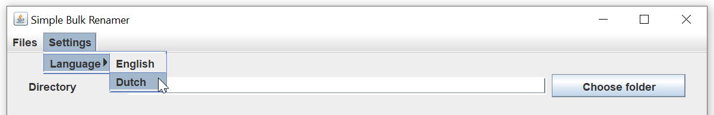
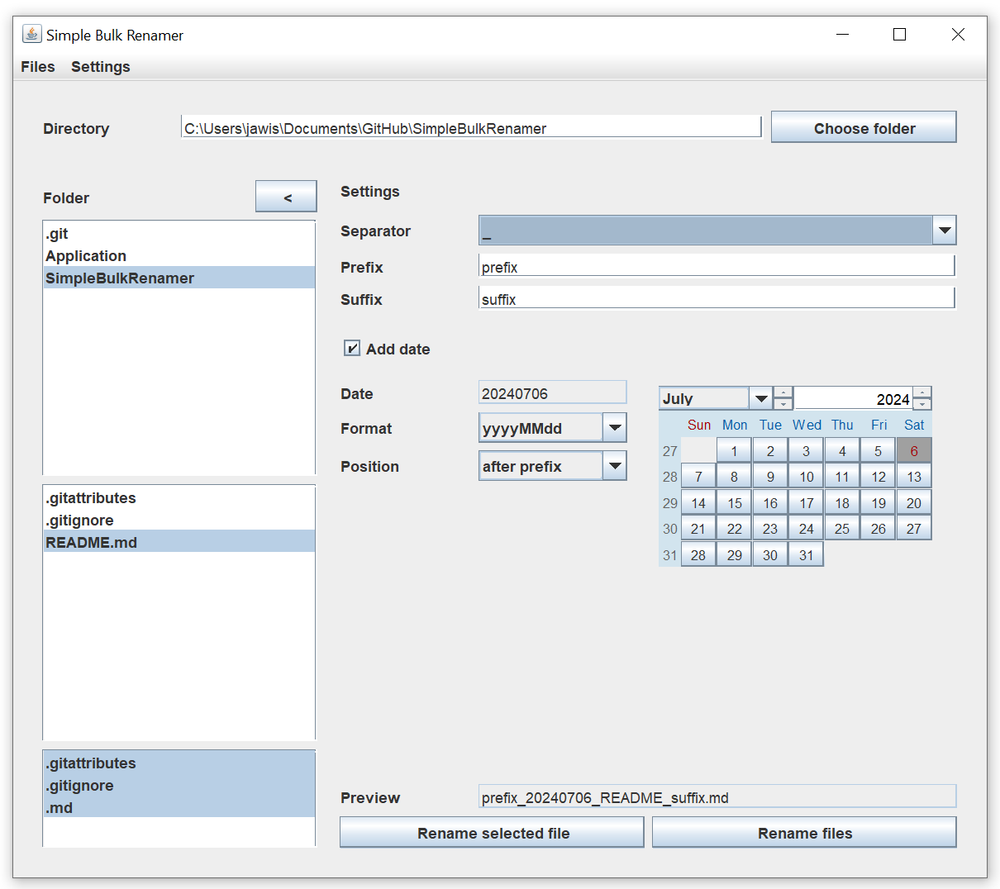
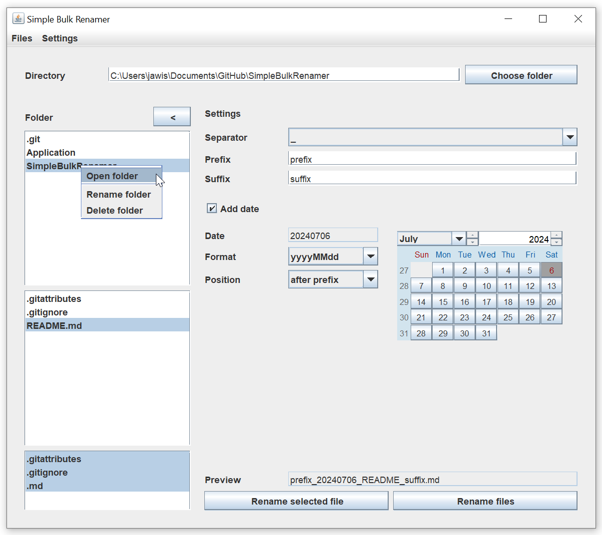
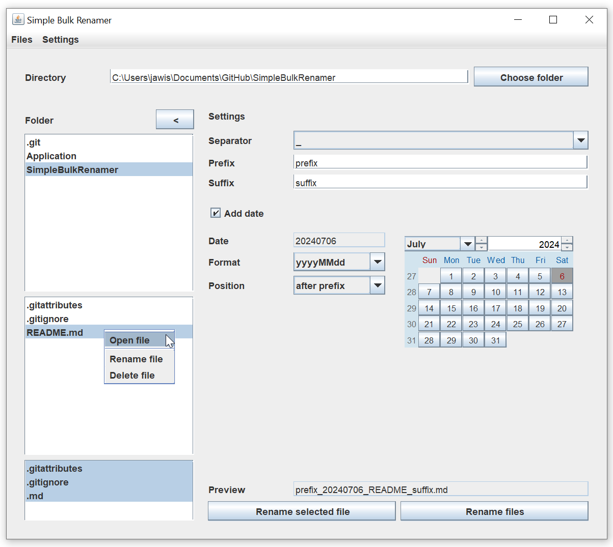

# SimpleBulkRenamer

SimpleBulkRenamer is a Java application that allows you to rename multiple files in a given directory.

## Application

You can view the source code or clone the repository.
If you only need the built jar file to use the application go to the [application folder](https://github.com/jawis-net/SimpleBulkRenamer/tree/main/Application).

### Language

SimpleBulkRenamer is currently available in two languages:

- English
- Dutch

To change the language go to the menu Settings > Language in the menubar and select the desired language.

### Third party packages

SimpleBulkRenamer uses the following packages:

- [Logback](https://logback.qos.ch/)
- [SLF4J](https://www.slf4j.org/index.html)
- [JCalendar](https://toedter.com/jcalendar/)

Shout out to the developers for providing these packages as open source

## Usage

To use SimpleBulkRenamer, simply follow these steps:

1. Open the .jar file, no installation needed.
2. Navigate to the directory containing the files to rename.
3. Filter by extensions to only rename the files with selected extensions.
4. Fill in the options to rename the files.
5. Check preview if the new file name is as exptected.
6. Rename all files in selected directory or rename a single file.

## License

SimpleBulkRenamer is licensed under the MIT License. See the [LICENSE](LICENSE) file for more information.

## Contributing

Contributions are welcome! If you find a bug or have an idea for a new feature, please open an issue or submit a pull request.

## Credits

SimpleBulkRenamer is developed and maintained by [jawis.net](https://github.com/jawis-net).

## Contact

If you have any questions or need help, feel free to reach out to [jawis.net](mailto:simplebulkrenamer@jawis.net).
